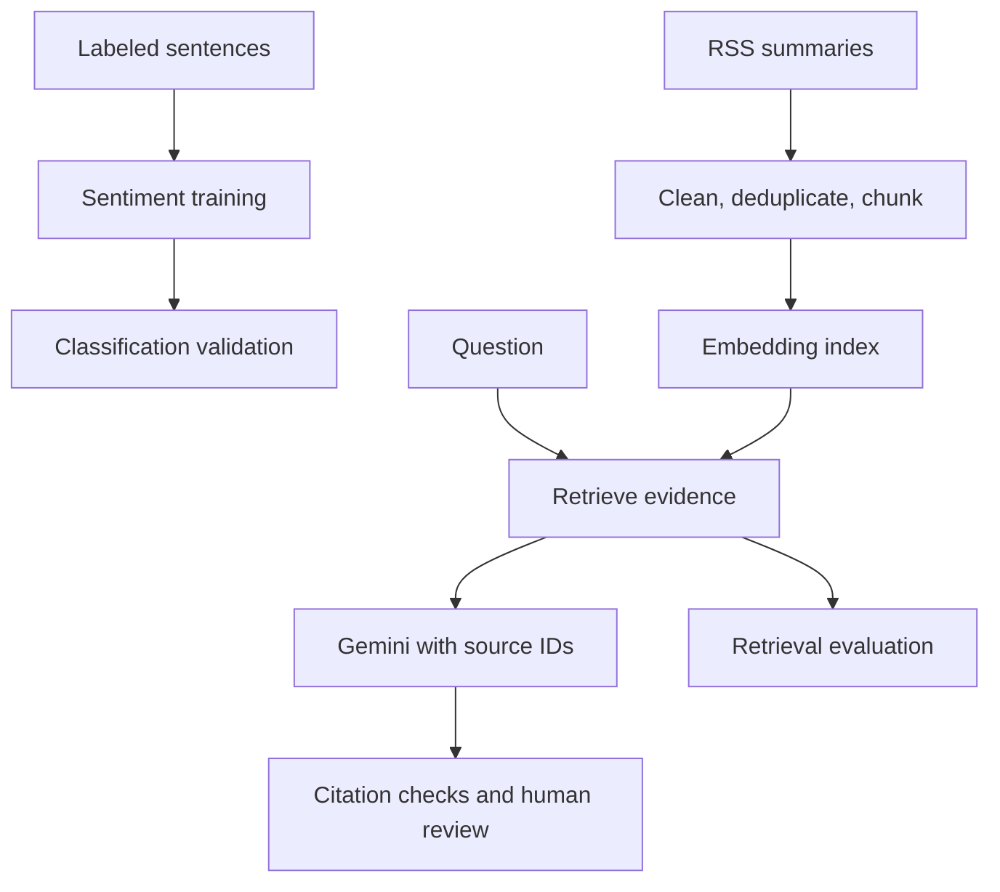

# 新闻智能分析与检索问答 | News Intelligence RAG Agent

中文在前，英文在后；图表与命令共用。 / Chinese first, English below; figures, tables and commands are shared.

一个 Python 项目，将**情感分类**、**证据检索**和**带来源引用的问答**分开实现，使各组件能够独立评测。

A Python portfolio project that separates **sentiment classification**, **evidence retrieval**, and **source-cited question answering** so each component can be evaluated independently.

原仓库描述了新闻分析 Notebook，但实际仅包含 README 和一个 `.textClipping` 文件。本版本依据提供的框架实现了可导入模块、命令行脚本及 Streamlit 页面，并保留原有历史。

The original repository described a news-analysis notebook but contained only a README and a `.textClipping` file. This version implements the supplied framework as importable modules, command-line scripts, and Streamlit interfaces. Existing history is retained.

## 当前验证情况 | Current evidence

- 离线测试覆盖清洗、去重、分块、向量检索、持久化、召回率、引用 ID 归属校验及重试行为。
- 虚构数据的端到端检索示例无需下载模型或配置 API 密钥，记录见 `reports/verification.json`。
- 本次重建**尚未验证** FinBERT 训练、语义模型下载、FAISS 运行、Gemini 回答质量或 Streamlit 在线部署。
- 暂不声称真实数据 F1、Recall@K 提升、幻觉减少比例、延迟服务保证或成本下降。

- Offline tests cover cleaning, deduplication, chunking, vector retrieval, persistence, recall, citation membership and retry behavior.
- A fictional end-to-end retrieval example runs without model downloads or API keys. See `reports/verification.json`.
- FinBERT training, semantic-model downloads, FAISS execution, Gemini quality evaluation and a live Streamlit deployment have **not** been verified in this reconstruction.
- No real-world F1, Recall@K improvement, hallucination reduction, latency SLA or cost reduction is claimed.

## 系统架构 | Architecture



本项目是检索辅助的分析应用，尚未实现多工具自主编排。

The project is a retrieval-assisted analysis application. Multi-tool autonomous orchestration is not implemented.

## 仓库结构 | Repository layout

```text
app.py                         Search and optional cited Gemini answers
label_app.py                   Human sentiment review and CSV download
src/news_agent/
  preprocessing.py             HTML cleaning, hashes and stable chunks
  retrieval.py                 Sentence Transformer / demo encoder, FAISS / NumPy
  rag.py                       Grounded prompts, transient retries, citation checks
  evaluation.py                Accuracy, Macro-F1, Recall@K and ID membership
scripts/
  prepare_phrasebank.py         Export and validate labeled data
  train_sentiment.py            Stratified training and checkpoint selection
  predict_sentiment.py          Batch sentiment inference from a saved model
  collect_rss.py                Collect source-attributed RSS summaries
  build_index.py                Build versioned portable vector artifacts
  evaluate_retrieval.py          Evaluate reviewed question / chunk-ID pairs
data/sample/                    Fictional fixtures and human-review template
tests/test_core.py               Offline tests
reports/                        Verification evidence
docs/                           Source specification and interview guide
```

## 安装与离线测试 | Install and run offline tests

```bash
python3 -m venv .venv
source .venv/bin/activate
python -m pip install -e ".[dev]"
python -m pytest -q
```

需要 Python 3.10 或以上版本。Windows PowerShell 使用 `.venv\Scripts\Activate.ps1` 激活环境。已安装核心依赖时，也可运行 `PYTHONPATH=src python -m unittest discover -s tests -v`。

Python 3.10+ is required. Windows PowerShell activation: `.venv\Scripts\Activate.ps1`.
With core dependencies already present, `PYTHONPATH=src python -m unittest discover -s tests -v` also works.

## 无需密钥的离线演示 | No-key offline demo

```bash
python scripts/build_index.py \
  --data data/sample/articles.csv \
  --output artifacts/demo_index --demo

python scripts/evaluate_retrieval.py \
  --eval data/sample/eval_questions.csv \
  --index artifacts/demo_index \
  --output artifacts/demo_retrieval_metrics.json
```

`--demo` 在六篇虚构文章上使用确定性的**词汇哈希编码器**。它用于功能验证，不能替代 Sentence Transformer 或真实评测集。构建索引时，输出目录必须为空。

`--demo` uses a deterministic **lexical hash encoder** on six fictional articles. It is a functionality test, not a substitute for Sentence Transformer or a real evaluation set. The index directory must be empty when building.

在本地打开演示页面：

To open the demo interface locally:

```bash
python -m pip install -e ".[app]"
NEWS_INDEX_PATH=artifacts/demo_index streamlit run app.py
```

检索功能无需 Gemini。配置好 API 访问前，请保持答案生成功能未勾选。

Search works without Gemini. Leave answer generation unchecked until API access is configured.

## 情感分类流程 | Sentiment workflow

```bash
python -m pip install -e ".[nlp]"
python scripts/prepare_phrasebank.py \
  --config sentences_allagree --output data/processed/sentiment.csv

# Alternative if the online dataset loader cannot load a legacy dataset script:
python scripts/prepare_phrasebank.py \
  --parquet data/raw/financial_phrasebank_allagree.parquet \
  --output data/processed/sentiment.csv

python scripts/train_sentiment.py \
  --data data/processed/sentiment.csv --model ProsusAI/finbert \
  --output artifacts/finbert --epochs 3

python scripts/predict_sentiment.py \
  --data data/processed/articles.csv --model artifacts/finbert/model \
  --output data/processed/labeled_articles.csv
```

从 [Financial PhraseBank](https://huggingface.co/datasets/takala/financial_phrasebank) 获取数据并核对许可及来源。准备脚本采用其 negative、neutral、positive 标签语义，删除规范化后完全重复的句子，并拒绝存在标签冲突的数据。

Obtain data from [Financial PhraseBank](https://huggingface.co/datasets/takala/financial_phrasebank) and review its license and provenance. The preparation script expects its documented negative/neutral/positive label semantics. It removes exact duplicate normalized sentences and rejects conflicting labels.

训练使用固定随机种子的分层 80/20 划分，依据验证集 Macro-F1 选择最佳检查点，并保存内容哈希、数据划分、标签映射和指标。脚本保留模型检查点中的语义标签顺序，该顺序可能与数据集的数字编号不同。在支持的入口中，可用 `--revision` 固定模型或数据集版本；比较基础模型时，可在相同输入和随机种子下使用 `--model FacebookAI/roberta-base`。

Training uses a seeded stratified 80/20 split and selects the best checkpoint by validation Macro-F1. It saves content hashes, split assignments, label mappings and metrics. It preserves semantic checkpoint label order, which may differ from dataset numeric IDs. Pass `--revision` to pin model/dataset revisions where supported; for a base-model comparison use `--model FacebookAI/roberta-base` with the same input and seed.

**评测局限：**检查点选择使用了验证集标签，因此这些分数不代表未参与选择的最终测试结果。预训练情感模型可能已经使用过 Financial PhraseBank，需核查模型训练来源，并使用单独人工复核的新新闻测试集，才能论证泛化表现或微调收益。

**Evaluation limitation:** checkpoint selection uses validation labels, so these scores are not an untouched final test. A pretrained sentiment checkpoint may have already seen Financial PhraseBank. Audit checkpoint provenance and use a separately reviewed fresh-news test set before claiming unbiased generalization or fine-tuning gains.

## RSS 采集与语义检索 | RSS collection and semantic retrieval

```bash
python -m pip install -e ".[app,retrieval]"
python scripts/collect_rss.py \
  --feed https://feeds.bbci.co.uk/news/business/rss.xml \
  --output data/processed/articles.csv

python scripts/build_index.py \
  --data data/processed/articles.csv --output artifacts/index
```

重复传入 `--feed` 可合并多个允许使用的来源。管线保留 `document_id,title,text,source,published` 字段，原始及处理后的新闻数据由 Git 忽略。RSS 摘要可能较短且信息不完整，应保留来源链接并遵守来源条款。

Repeat `--feed` to combine permitted sources. The pipeline keeps `document_id,title,text,source,published`. Raw/processed news is ignored by Git. RSS summaries may be short and incomplete; retain source links and respect source terms.

文章按清洗后内容的 SHA-256 去重，再通过重叠分块生成稳定的 `document_id:chunk_number` ID。向量进行 L2 归一化，安装 FAISS 时使用 `IndexFlatIP` 实现余弦相似度检索，否则使用 NumPy 功能回退。索引以可移植的 `.npy` 向量数组和 JSON 元数据保存，不使用 pickle；加载时若 FAISS 可用则重建索引。元数据记录编码器、请求的版本、数据哈希、维度和分块设置。比较实验时应固定模型版本与完整运行环境。

Documents are deduplicated by cleaned-content SHA-256, then split with overlap into stable `document_id:chunk_number` IDs. Vectors are L2-normalized. FAISS `IndexFlatIP` implements cosine retrieval when installed; NumPy is a functional fallback. A portable `.npy` vector array and JSON metadata are saved without pickle. Loading rebuilds the FAISS index when available. Metadata records encoder identity, requested revision, source hash, dimensions and chunk settings. Keep model revisions and exact environments fixed for comparable experiments.

## Gemini 引用问答 | Gemini answers

将 `GEMINI_API_KEY` 和 `GEMINI_MODEL` 设置为环境变量，模型名称需选择你账号当前可用的模型，然后运行：

Set `GEMINI_API_KEY` and `GEMINI_MODEL` as environment variables using a model available to your account, then run:

```bash
streamlit run app.py
```

`.env.example` 仅列出变量，不会自动加载。请勿提交真实密钥。`NEWS_INDEX_PATH` 默认值为 `artifacts/index`。

`.env.example` lists the variables but is not automatically loaded. Never commit real secrets. `NEWS_INDEX_PATH` defaults to `artifacts/index`.

提示词将文章视为不可信数据，限制模型仅依据证据回答，要求使用 `[chunk_id]` 引用，并在证据不足时拒答。没有检索上下文时会直接本地拒答，不调用 API；临时错误采用退避重试，总尝试次数最多为三次，永久错误立即失败。未知或缺失引用会被拒绝。不过，提示词和 ID 校验无法证明事实得到支持，也不能保证完全防御提示注入。

The prompt treats article content as untrusted data, restricts answers to evidence, requires `[chunk_id]` citations and asks for refusal when evidence is insufficient. No retrieved context produces a local refusal without an API call. Transient failures retry at most three total attempts with backoff; permanent errors fail immediately. Unknown/missing citations are rejected. Prompt instructions and ID checks do not prove factual support or guarantee resistance to prompt injection.

RAG 函数记录耗时、API 尝试次数及返回的用量元数据，不猜测 API 价格，成本字段明确留空。Streamlit 展示证据片段、来源链接、相似度和总耗时。

The RAG function reports elapsed time, API attempts and returned usage metadata. It does not guess API prices; cost is explicitly unset. Streamlit displays passages, source links, similarity and total elapsed time.

## 人工复核与评测 | Human review and evaluation

```bash
streamlit run label_app.py
python scripts/evaluate_retrieval.py \
  --eval data/processed/eval_questions.csv --index artifacts/index \
  --output artifacts/retrieval_metrics.json
```

标注页面保留文档 ID，并导出复核人、人工标签、备注及复核状态。标记为已复核的行必须填写标签和复核人。下载由用户控制，不会静默覆盖共享数据。

The label interface preserves document IDs and exports reviewer, human label, notes and reviewed status. A reviewed row must have a label and reviewer. Downloads are user-controlled; it does not silently overwrite shared data.

检索评测 CSV 包含 `question,relevant_chunk_ids`，多个相关 ID 用 `|` 分隔，所有相关 ID 必须存在于固定索引中。Recall@K 表示前 K 条结果覆盖全部相关 ID 的比例，再对问题取平均。空的相关集合会被拒绝，拒答问题需使用单独的回答质量评测集。

Retrieval evaluation CSVs contain `question,relevant_chunk_ids`, with multiple relevant IDs separated by `|`. All relevant IDs must exist in the frozen index. Recall@K is the fraction of all relevant IDs retrieved in the first K results, averaged across questions. Empty relevance sets are rejected; refusal questions require a separate answer-quality set.

| Component | Metric | Evidence needed |
|---|---|---|
| Sentiment | Accuracy and Macro-F1 | Independent human-labeled examples |
| Retrieval | Recall@1, @3, @5 | Reviewed questions and relevant chunk IDs |
| Citation format | Citation-ID precision | IDs cited belong to retrieved evidence |
| Answer quality | Relevance, factual support, refusal | Human ratings using `answer_review_template.csv` |
| Runtime | Latency, API attempts, usage | Recorded real runs and account pricing for cost |

引用 ID 精确率**只检查 ID 是否属于检索结果**，不代表语义上的引用正确性。未包含引用的回答没有该精确率值，RAG 会拒绝缺少引用的实质性回答。近重复识别、股票代码及日期的精确匹配、重排序和混合检索仍属于后续工作。

Citation-ID precision is **membership only**, not semantic citation correctness. Uncited answers receive no precision value; RAG rejects substantive answers without citations. Near duplicates, exact ticker/date matching, reranking and hybrid retrieval remain future work.

## GitHub 与应用部署 | GitHub and deployment

将代码上传到 GitHub 不会自动托管 Streamlit 服务，本项目目前没有已验证的在线应用地址。发布演示前，需单独安装依赖、构建真实索引并配置托管环境。详见[部署说明](docs/DEPLOYMENT.md)和[附有证据状态说明的面试手册](docs/PROJECT_PORTFOLIO_GUIDE.md)。

Uploading code to GitHub does not host the Streamlit service. No live application URL is claimed here. Install dependencies, build a real index and configure the hosting environment separately before publishing a demo. See [deployment notes](docs/DEPLOYMENT.md) and [the evidence-qualified interview guide](docs/PROJECT_PORTFOLIO_GUIDE.md).
