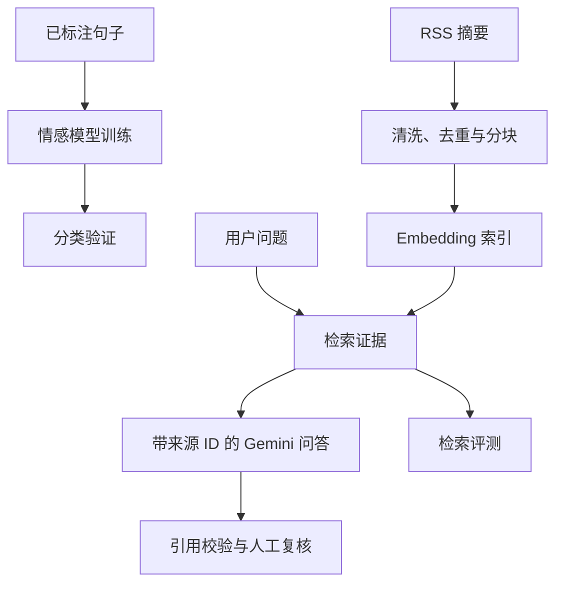

# 新闻智能分析与检索问答

一个 Python 项目，将**情感分类**、**证据检索**和**带来源引用的问答**分开实现，使各组件能够独立评测。

原仓库描述了新闻分析 Notebook，但实际仅包含 README 和一个 `.textClipping` 文件。本版本依据提供的框架实现了可导入模块、命令行脚本及 Streamlit 页面，并保留原有历史。

## 当前验证情况

- 离线测试覆盖清洗、去重、分块、向量检索、持久化、召回率、引用 ID 归属校验及重试行为。
- 虚构数据的端到端检索示例无需下载模型或配置 API 密钥，记录见 `reports/verification.json`。
- 本次重建**尚未验证** FinBERT 训练、语义模型下载、FAISS 运行、Gemini 回答质量或 Streamlit 在线部署。
- 暂不声称真实数据 F1、Recall@K 提升、幻觉减少比例、延迟服务保证或成本下降。

## 系统架构



本项目是检索辅助的分析应用，尚未实现多工具自主编排。

## 仓库结构

```text
app.py                         检索与可选的 Gemini 引用问答
label_app.py                   情感标签人工复核与 CSV 下载
src/news_agent/
  preprocessing.py             HTML 清洗、哈希与稳定分块
  retrieval.py                 Sentence Transformer／演示编码器，FAISS／NumPy
  rag.py                       证据约束提示、临时错误重试与引用校验
  evaluation.py                Accuracy、Macro-F1、Recall@K 与 ID 归属校验
scripts/
  prepare_phrasebank.py         导出并校验标注数据
  train_sentiment.py            分层训练与检查点选择
  predict_sentiment.py          使用已保存模型进行批量情感推理
  collect_rss.py                采集保留来源的 RSS 摘要
  build_index.py                构建带版本信息的可移植向量索引
  evaluate_retrieval.py          评估已复核的问题与片段 ID 对
data/sample/                    虚构示例与人工复核模板
tests/test_core.py               离线测试
reports/                        验证证据
docs/                           原始说明与面试手册
```

## 安装与离线测试

```bash
python3 -m venv .venv
source .venv/bin/activate
python -m pip install -e ".[dev]"
python -m pytest -q
```

需要 Python 3.10 或以上版本。Windows PowerShell 使用 `.venv\Scripts\Activate.ps1` 激活环境。已安装核心依赖时，也可运行 `PYTHONPATH=src python -m unittest discover -s tests -v`。

## 无需密钥的离线演示

```bash
python scripts/build_index.py \
  --data data/sample/articles.csv \
  --output artifacts/demo_index --demo

python scripts/evaluate_retrieval.py \
  --eval data/sample/eval_questions.csv \
  --index artifacts/demo_index \
  --output artifacts/demo_retrieval_metrics.json
```

`--demo` 在六篇虚构文章上使用确定性的**词汇哈希编码器**。它用于功能验证，不能替代 Sentence Transformer 或真实评测集。构建索引时，输出目录必须为空。

在本地打开演示页面：

```bash
python -m pip install -e ".[app]"
NEWS_INDEX_PATH=artifacts/demo_index streamlit run app.py
```

检索功能无需 Gemini。配置好 API 访问前，请保持答案生成功能未勾选。

## 情感分类流程

```bash
python -m pip install -e ".[nlp]"
python scripts/prepare_phrasebank.py \
  --config sentences_allagree --output data/processed/sentiment.csv

# 若在线加载器无法加载旧版数据集脚本，可改用本地文件：
python scripts/prepare_phrasebank.py \
  --parquet data/raw/financial_phrasebank_allagree.parquet \
  --output data/processed/sentiment.csv

python scripts/train_sentiment.py \
  --data data/processed/sentiment.csv --model ProsusAI/finbert \
  --output artifacts/finbert --epochs 3

python scripts/predict_sentiment.py \
  --data data/processed/articles.csv --model artifacts/finbert/model \
  --output data/processed/labeled_articles.csv
```

从 [Financial PhraseBank](https://huggingface.co/datasets/takala/financial_phrasebank) 获取数据并核对许可及来源。准备脚本采用其 negative、neutral、positive 标签语义，删除规范化后完全重复的句子，并拒绝存在标签冲突的数据。

训练使用固定随机种子的分层 80/20 划分，依据验证集 Macro-F1 选择最佳检查点，并保存内容哈希、数据划分、标签映射和指标。脚本保留模型检查点中的语义标签顺序，该顺序可能与数据集的数字编号不同。在支持的入口中，可用 `--revision` 固定模型或数据集版本；比较基础模型时，可在相同输入和随机种子下使用 `--model FacebookAI/roberta-base`。

**评测局限：**检查点选择使用了验证集标签，因此这些分数不代表未参与选择的最终测试结果。预训练情感模型可能已经使用过 Financial PhraseBank，需核查模型训练来源，并使用单独人工复核的新新闻测试集，才能论证泛化表现或微调收益。

## RSS 采集与语义检索

```bash
python -m pip install -e ".[app,retrieval]"
python scripts/collect_rss.py \
  --feed https://feeds.bbci.co.uk/news/business/rss.xml \
  --output data/processed/articles.csv

python scripts/build_index.py \
  --data data/processed/articles.csv --output artifacts/index
```

重复传入 `--feed` 可合并多个允许使用的来源。管线保留 `document_id,title,text,source,published` 字段，原始及处理后的新闻数据由 Git 忽略。RSS 摘要可能较短且信息不完整，应保留来源链接并遵守来源条款。

文章按清洗后内容的 SHA-256 去重，再通过重叠分块生成稳定的 `document_id:chunk_number` ID。向量进行 L2 归一化，安装 FAISS 时使用 `IndexFlatIP` 实现余弦相似度检索，否则使用 NumPy 功能回退。索引以可移植的 `.npy` 向量数组和 JSON 元数据保存，不使用 pickle；加载时若 FAISS 可用则重建索引。元数据记录编码器、请求的版本、数据哈希、维度和分块设置。比较实验时应固定模型版本与完整运行环境。

## Gemini 引用问答

将 `GEMINI_API_KEY` 和 `GEMINI_MODEL` 设置为环境变量，模型名称需选择你账号当前可用的模型，然后运行：

```bash
streamlit run app.py
```

`.env.example` 仅列出变量，不会自动加载。请勿提交真实密钥。`NEWS_INDEX_PATH` 默认值为 `artifacts/index`。

提示词将文章视为不可信数据，限制模型仅依据证据回答，要求使用 `[chunk_id]` 引用，并在证据不足时拒答。没有检索上下文时会直接本地拒答，不调用 API；临时错误采用退避重试，总尝试次数最多为三次，永久错误立即失败。未知或缺失引用会被拒绝。不过，提示词和 ID 校验无法证明事实得到支持，也不能保证完全防御提示注入。

RAG 函数记录耗时、API 尝试次数及返回的用量元数据，不猜测 API 价格，成本字段明确留空。Streamlit 展示证据片段、来源链接、相似度和总耗时。

## 人工复核与评测

```bash
streamlit run label_app.py
python scripts/evaluate_retrieval.py \
  --eval data/processed/eval_questions.csv --index artifacts/index \
  --output artifacts/retrieval_metrics.json
```

标注页面保留文档 ID，并导出复核人、人工标签、备注及复核状态。标记为已复核的行必须填写标签和复核人。下载由用户控制，不会静默覆盖共享数据。

检索评测 CSV 包含 `question,relevant_chunk_ids`，多个相关 ID 用 `|` 分隔，所有相关 ID 必须存在于固定索引中。Recall@K 表示前 K 条结果覆盖全部相关 ID 的比例，再对问题取平均。空的相关集合会被拒绝，拒答问题需使用单独的回答质量评测集。

| 组件 | 指标 | 所需证据 |
|---|---|---|
| 情感分类 | Accuracy、Macro-F1 | 独立人工标注样本 |
| 检索 | Recall@1、@3、@5 | 已复核的问题及相关片段 ID |
| 引用格式 | 引用 ID 精确率 | 引用 ID 属于检索证据 |
| 回答质量 | 相关性、事实支持、拒答 | 使用 `answer_review_template.csv` 记录人工评分 |
| 运行表现 | 延迟、API 尝试次数、用量 | 真实运行记录；成本需结合账号价格计算 |

引用 ID 精确率**只检查 ID 是否属于检索结果**，不代表语义上的引用正确性。未包含引用的回答没有该精确率值，RAG 会拒绝缺少引用的实质性回答。近重复识别、股票代码及日期的精确匹配、重排序和混合检索仍属于后续工作。

## GitHub 与应用部署

将代码上传到 GitHub 不会自动托管 Streamlit 服务，本项目目前没有已验证的在线应用地址。发布演示前，需单独安装依赖、构建真实索引并配置托管环境。详见[部署说明](docs/DEPLOYMENT.md)和[附有证据状态说明的面试手册](docs/PROJECT_PORTFOLIO_GUIDE.md)。
