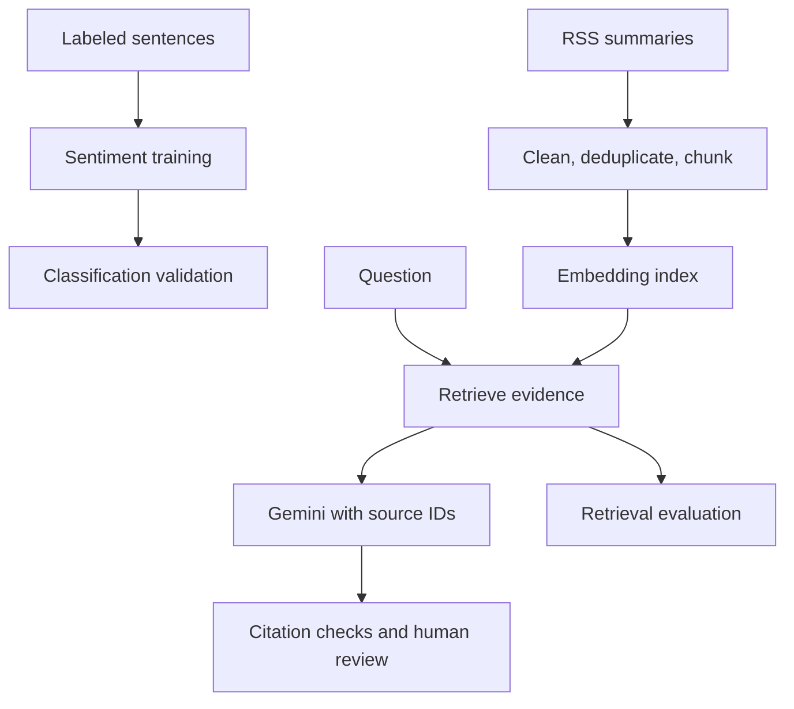

# News Intelligence Analysis & Retrieval Agent

A Python portfolio project that separates **sentiment classification**, **evidence retrieval**, and **source-cited question answering** so each component can be evaluated independently.

The original repository described a news-analysis notebook but contained only a README and a `.textClipping` file. This version implements the supplied framework as importable modules, command-line scripts, and Streamlit interfaces. Existing history is retained.

## Current evidence

- Offline tests cover cleaning, deduplication, chunking, vector retrieval, persistence, recall, citation membership and retry behavior.
- A fictional end-to-end retrieval example runs without model downloads or API keys. See `reports/verification.json`.
- FinBERT training, semantic-model downloads, FAISS execution, Gemini quality evaluation and a live Streamlit deployment have **not** been verified in this reconstruction.
- No real-world F1, Recall@K improvement, hallucination reduction, latency SLA or cost reduction is claimed.

## Architecture



The project is a retrieval-assisted analysis application. Multi-tool autonomous orchestration is not implemented.

## Repository layout

```text
app.py                         Search and optional cited Gemini answers
label_app.py                   Human sentiment review and CSV download
src/news_agent/
  preprocessing.py             HTML cleaning, hashes and stable chunks
  retrieval.py                 Sentence Transformer / demo encoder, FAISS / NumPy
  rag.py                       Grounded prompts, transient retries, citation checks
  evaluation.py                Accuracy, Macro-F1, Recall@K and ID membership
scripts/
  prepare_phrasebank.py         Export and validate labeled data
  train_sentiment.py            Stratified training and checkpoint selection
  predict_sentiment.py          Batch sentiment inference from a saved model
  collect_rss.py                Collect source-attributed RSS summaries
  build_index.py                Build versioned portable vector artifacts
  evaluate_retrieval.py          Evaluate reviewed question / chunk-ID pairs
data/sample/                    Fictional fixtures and human-review template
tests/test_core.py               Offline tests
reports/                        Verification evidence
docs/                           Source specification and interview guide
```

## Install and run offline tests

```bash
python3 -m venv .venv
source .venv/bin/activate
python -m pip install -e ".[dev]"
python -m pytest -q
```

Python 3.10+ is required. Windows PowerShell activation: `.venv\Scripts\Activate.ps1`.
With core dependencies already present, `PYTHONPATH=src python -m unittest discover -s tests -v` also works.

## No-key offline demo

```bash
python scripts/build_index.py \
  --data data/sample/articles.csv \
  --output artifacts/demo_index --demo

python scripts/evaluate_retrieval.py \
  --eval data/sample/eval_questions.csv \
  --index artifacts/demo_index \
  --output artifacts/demo_retrieval_metrics.json
```

`--demo` uses a deterministic **lexical hash encoder** on six fictional articles. It is a functionality test, not a substitute for Sentence Transformer or a real evaluation set. The index directory must be empty when building.

To open the demo interface locally:

```bash
python -m pip install -e ".[app]"
NEWS_INDEX_PATH=artifacts/demo_index streamlit run app.py
```

Search works without Gemini. Leave answer generation unchecked until API access is configured.

## Sentiment workflow

```bash
python -m pip install -e ".[nlp]"
python scripts/prepare_phrasebank.py \
  --config sentences_allagree --output data/processed/sentiment.csv

# Alternative if the online dataset loader cannot load a legacy dataset script:
python scripts/prepare_phrasebank.py \
  --parquet data/raw/financial_phrasebank_allagree.parquet \
  --output data/processed/sentiment.csv

python scripts/train_sentiment.py \
  --data data/processed/sentiment.csv --model ProsusAI/finbert \
  --output artifacts/finbert --epochs 3

python scripts/predict_sentiment.py \
  --data data/processed/articles.csv --model artifacts/finbert/model \
  --output data/processed/labeled_articles.csv
```

Obtain data from [Financial PhraseBank](https://huggingface.co/datasets/takala/financial_phrasebank) and review its license and provenance. The preparation script expects its documented negative/neutral/positive label semantics. It removes exact duplicate normalized sentences and rejects conflicting labels.

Training uses a seeded stratified 80/20 split and selects the best checkpoint by validation Macro-F1. It saves content hashes, split assignments, label mappings and metrics. It preserves semantic checkpoint label order, which may differ from dataset numeric IDs. Pass `--revision` to pin model/dataset revisions where supported; for a base-model comparison use `--model FacebookAI/roberta-base` with the same input and seed.

**Evaluation limitation:** checkpoint selection uses validation labels, so these scores are not an untouched final test. A pretrained sentiment checkpoint may have already seen Financial PhraseBank. Audit checkpoint provenance and use a separately reviewed fresh-news test set before claiming unbiased generalization or fine-tuning gains.

## RSS collection and semantic retrieval

```bash
python -m pip install -e ".[app,retrieval]"
python scripts/collect_rss.py \
  --feed https://feeds.bbci.co.uk/news/business/rss.xml \
  --output data/processed/articles.csv

python scripts/build_index.py \
  --data data/processed/articles.csv --output artifacts/index
```

Repeat `--feed` to combine permitted sources. The pipeline keeps `document_id,title,text,source,published`. Raw/processed news is ignored by Git. RSS summaries may be short and incomplete; retain source links and respect source terms.

Documents are deduplicated by cleaned-content SHA-256, then split with overlap into stable `document_id:chunk_number` IDs. Vectors are L2-normalized. FAISS `IndexFlatIP` implements cosine retrieval when installed; NumPy is a functional fallback. A portable `.npy` vector array and JSON metadata are saved without pickle. Loading rebuilds the FAISS index when available. Metadata records encoder identity, requested revision, source hash, dimensions and chunk settings. Keep model revisions and exact environments fixed for comparable experiments.

## Gemini answers

Set `GEMINI_API_KEY` and `GEMINI_MODEL` as environment variables using a model available to your account, then run:

```bash
streamlit run app.py
```

`.env.example` lists the variables but is not automatically loaded. Never commit real secrets. `NEWS_INDEX_PATH` defaults to `artifacts/index`.

The prompt treats article content as untrusted data, restricts answers to evidence, requires `[chunk_id]` citations and asks for refusal when evidence is insufficient. No retrieved context produces a local refusal without an API call. Transient failures retry at most three total attempts with backoff; permanent errors fail immediately. Unknown/missing citations are rejected. Prompt instructions and ID checks do not prove factual support or guarantee resistance to prompt injection.

The RAG function reports elapsed time, API attempts and returned usage metadata. It does not guess API prices; cost is explicitly unset. Streamlit displays passages, source links, similarity and total elapsed time.

## Human review and evaluation

```bash
streamlit run label_app.py
python scripts/evaluate_retrieval.py \
  --eval data/processed/eval_questions.csv --index artifacts/index \
  --output artifacts/retrieval_metrics.json
```

The label interface preserves document IDs and exports reviewer, human label, notes and reviewed status. A reviewed row must have a label and reviewer. Downloads are user-controlled; it does not silently overwrite shared data.

Retrieval evaluation CSVs contain `question,relevant_chunk_ids`, with multiple relevant IDs separated by `|`. All relevant IDs must exist in the frozen index. Recall@K is the fraction of all relevant IDs retrieved in the first K results, averaged across questions. Empty relevance sets are rejected; refusal questions require a separate answer-quality set.

| Component | Metric | Evidence needed |
|---|---|---|
| Sentiment | Accuracy and Macro-F1 | Independent human-labeled examples |
| Retrieval | Recall@1, @3, @5 | Reviewed questions and relevant chunk IDs |
| Citation format | Citation-ID precision | IDs cited belong to retrieved evidence |
| Answer quality | Relevance, factual support, refusal | Human ratings using `answer_review_template.csv` |
| Runtime | Latency, API attempts, usage | Recorded real runs and account pricing for cost |

Citation-ID precision is **membership only**, not semantic citation correctness. Uncited answers receive no precision value; RAG rejects substantive answers without citations. Near duplicates, exact ticker/date matching, reranking and hybrid retrieval remain future work.

## GitHub and deployment

Uploading code to GitHub does not host the Streamlit service. No live application URL is claimed here. Install dependencies, build a real index and configure the hosting environment separately before publishing a demo. See [deployment notes](docs/DEPLOYMENT.md) and [the evidence-qualified interview guide](docs/PROJECT_PORTFOLIO_GUIDE.md).
